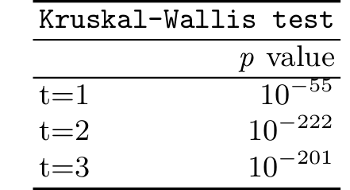
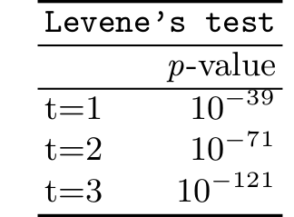
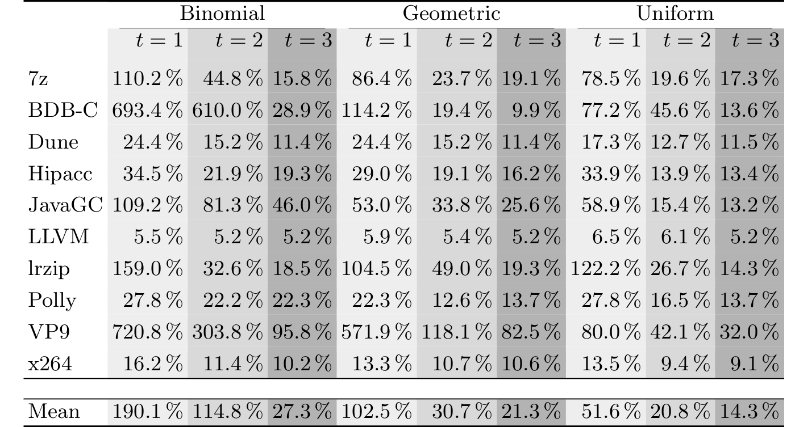
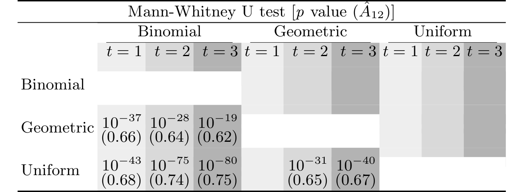
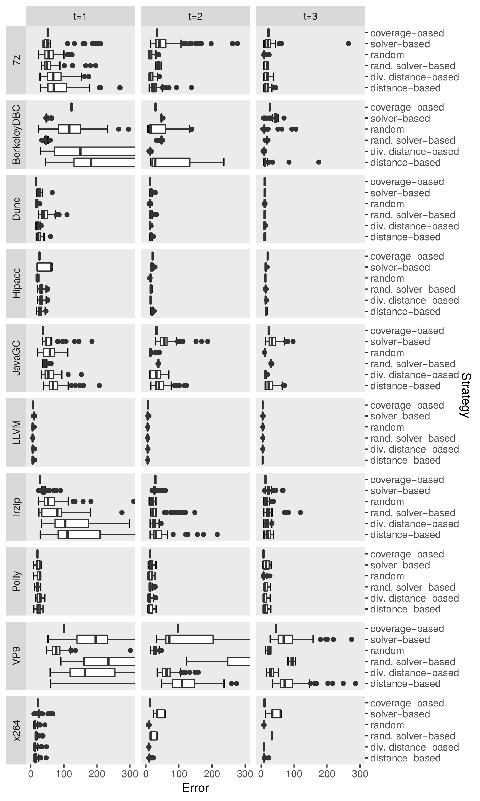

# Distance-Based Sampling of Software Configuration Spaces (Supplementary Website)

For the reproduction of our results, please refer to the [base directory of this repository](https://github.com/se-passau/Distance-Based_Data).

In the first part, we briefly describe the location of the raw data.
In part 2, we show the results of the Kruskal-Wallis test for different sample sizes.
In part 3, we show the results of the Levene's test for different variances.
In part 4, we show the error rates by using different distributions.
In part 5, we show the variances of the sampling strategies. 
In part 6, we show the performance wall time of the sampling strategies.
Last, in part 7, we show the results when paring different machine-learning techniques with respect to their accuracy in predicting all configurations. 

## 1 Prediction Results

The prediction results for the subject systems can be accessed in the directory *Predictions*, which has two subdirectories, *DetailedPredictions* and *SummarizedPredictions*.
In the directory *SummarizedPredictions*, we have summarized our results in different csv-files and provide the feature models (i.e., variability models), whereas the results of all 100 runs of all subject systems are stored in the directory *DetailedPredictions*.

**New**: We additionally provide the data from the subject systems in the folder [RawPerformanceMeasurements](RawPerformanceMeasurements/). Further information is provided there.

## 2 Results of the Kruskal-Wallis Test

In the following, we present the results for the Kruskal-Wallis test:

## 3 Results of the Levene Test

In the following, we present the results for the Levene's test:

## 4 Error Rates of the Distributions

For a detailed view on the error rates by using the optimized distance-based sampling strategy with different distributions (binomial distribution, geometric distribution, uniform distribution), we provide the following tables.

## 5 Variance of the Sampling Strategies

For a detailed view on the variances of the sampling strategies on the subject systems in the sample sizes *t=1*, *t=2*, and *t=3*, we provide the following table.

## 6 Wall Time

In the following, we provide the wall time for the sampling strategies and the subject systems presented in the paper.

**Note**: For true random, we have only measured acquiring the whole population, since this needs the most time.
Drawing from the whole population is negligible.

Generally, solver-based sampling has the lowest wall time. The reason for that is because of the simple SAT calls. 
Coverage-based sampling is as generally similarly fast as distance-based sampling.
The randomized solver-based sampling and true random sampling indicate the highest wall time, mainly in the larger subject systems.

## 7 Machine-Learning Techniques

In the parallel line of experiments, we compared six different machine-learning techniques:
* Classification And Regression Trees (CART)
* k-Nearest Neighbors (knn)
* Kernel Ridge Regression (KRR)
* Multiple Linear Regression (MR)
* Random Forest (RF)
* Support Vector Machines (SVR)

In the paper, we have used MR.

The comparison was performed on software systems that contain binary and numeric configuration options.
Thus, we used binary **and** numeric sampling strategies.
The binary sampling strategies are:
* Option-Wise (OW)
* Negative Option-Wise (NegOW)
* Pair-Wise / t-wise with *t=2* (T2)
* Tripple-Wise / t-wise with *t=3* (T3)

In the following table, we illustrate the results of the comparison as a heat map.

In the table, we perform a pair-wise comparison of the machine-learning techniques with respect to their accuracy in predicting the performance of all configurations. On the diagonal, we show the prediction error of the respective machine-learning technique. 
For the plots not on the diagonal, we show the difference between the machine-learning technique in the row to the machine-learning technique in the column. 
The green color indicates that the machine-learning technique in the column is more accurate, whereas the red color indicates that the machine-learning technique in the row is more accurate. 
As we can see, CART, MR, and RF outperform the other machine-learning technique. 
However, RF has slightly lower error rates than CART and MR, as can be seen on the diagonal. 
Besides, we also see that the accuracy of the machine-learning technique strongly depends on the learning set. 
